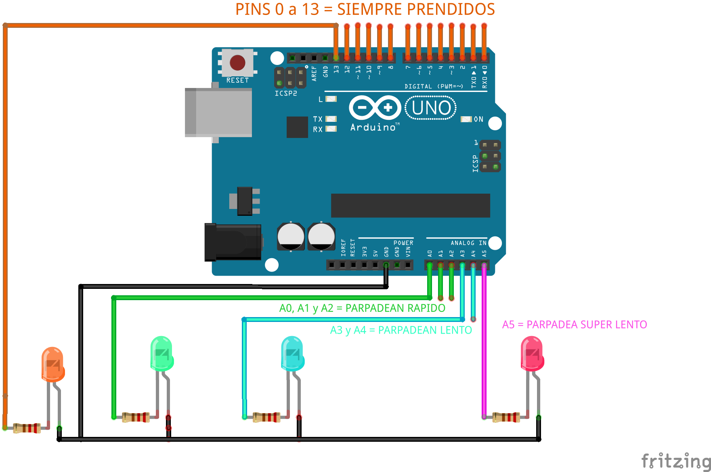

# Ciudades Luminosas

### **Resumen**
Código para el taller de Ciudades Luminosas, tiene todos los pines digitales en HIGH, también tiene 3 grupos con diferentes tiempo de retardo de parpadeo en los pines analógicos, para poder alimentar muchos LEDs.

Para este sketch utilizamos los puertos para acceder de forma mas rapida y eficiente a los pines de nuestro microcontrolador.

### **Links utiles**
Mas informacion sobre [Manipulacion de Puertos](https://www.arduino.cc/en/Reference/PortManipulation) en la documentacion de Arduino.
